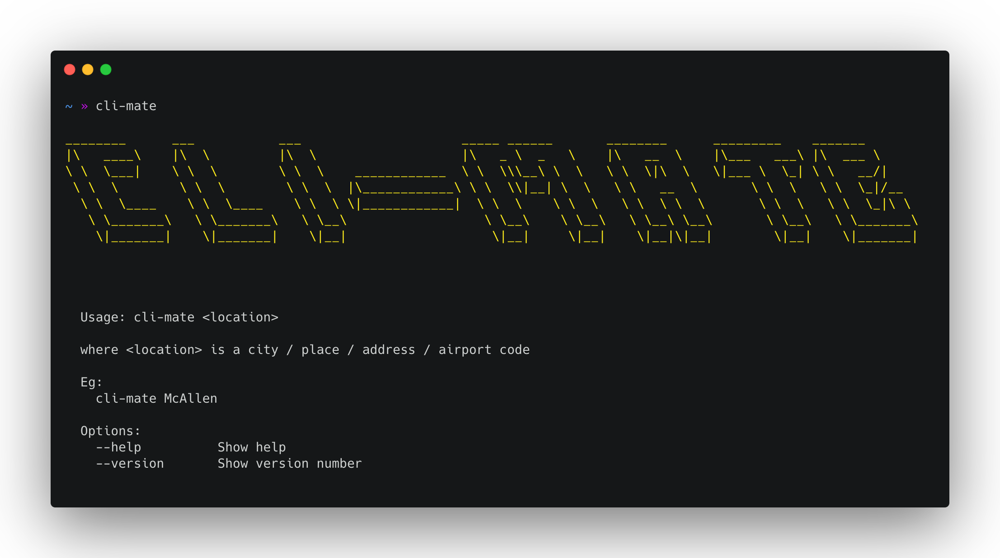

[](https://github.com/jmtellez/Weather-CLI/issues)&nbsp;

# CLI-mate :sunrise:

Command Line application that gives you the weather info for a given `city/place/address/airport code` :sunny:



**Install**
```bash
npm install -g @jmt3559/cli-mate
```

On your terminal export these two environment variables:

**Zsh**
```bash 
echo 'export MAPBOX=API_KEY' >>  ~/.zprofile

echo 'export WEATHERSTACK=API_KEY' >> ~/.zprofile
```

**Bash**
```bash
echo 'export MAPBOX=API_KEY' >>  ~/.bash_profile

echo 'export WEATHERSTACK=API_KEY' >> ~/.bash_profile
```

## Get API Keys
### [Weatherstack](https://weatherstack.com/) - 1k free requests per month

### [Mapbox](https://docs.mapbox.com/) - 100K free requests
