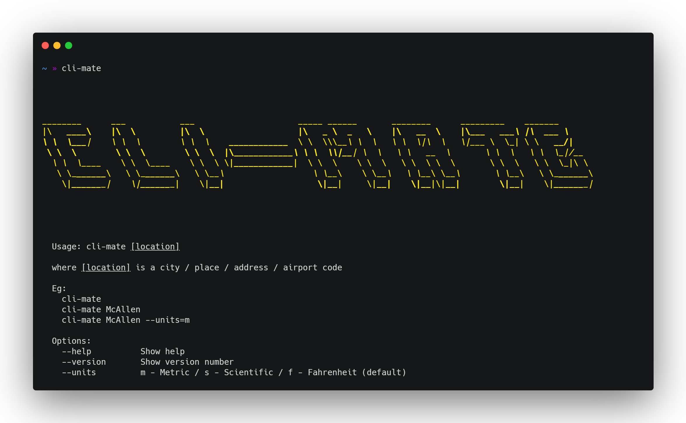

[](https://github.com/jmtellez/Weather-CLI/issues)&nbsp;

# Weather - CLI :sunrise:

`Node.js` CLI app that gives you the weather forecast for a given city :sunny:



Create a `.env` file in the root directory and add the following vars:

```ini
MAPBOX=API_KEY
WEATHERSTACK=API_KEY
```

### [Weatherstack](https://weatherstack.com/) - 1k free requests per month

### [Mapbox](https://docs.mapbox.com/) - 100K free requests
